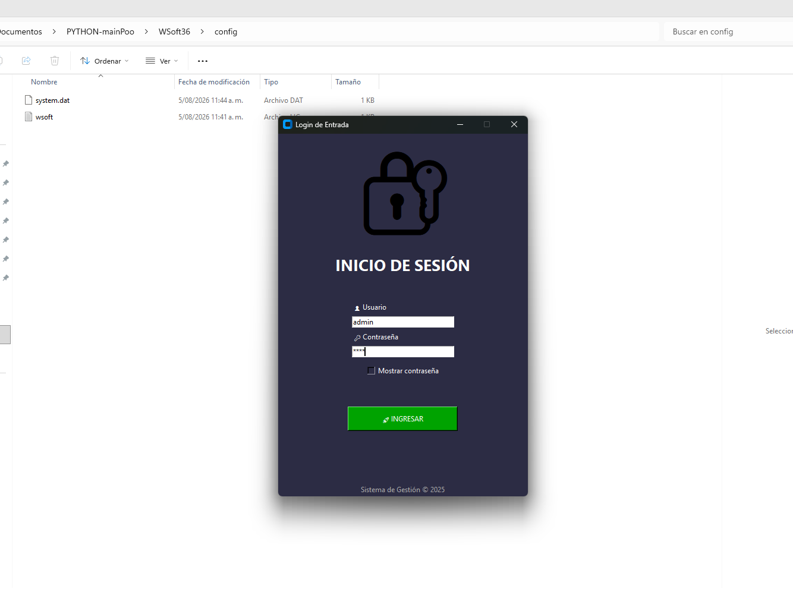

# WSoft Lite 1.6

**Sistema de gestión comercial para pequeños negocios y emprendimientos.**

WSoft Lite es una aplicación de escritorio desarrollada en Python para facilitar la gestión diaria de productos, inventario, clientes, proveedores, compras y ventas desde una interfaz sencilla y práctica.

---

## 🚀 Características

* 📦 Gestión de productos e inventario
* 📊 Control de stock y movimientos
* 👥 Gestión de clientes
* 🏢 Gestión de proveedores
* 👤 Gestión de vendedores
* 🛒 Punto de venta (POS)
* 🧾 Gestión de compras
* 📋 Kardex de inventario
* 📈 Inventario valorizado
* 📑 Reportes
* 📊 Exportación de información a Excel
* 📄 Generación de documentos PDF
* 💾 Copias de seguridad y restauración
* 🔐 Sistema de licencias
* 🧪 Modo DEMO para evaluación

---

## 🧩 Módulos principales

### Inventario

Gestión de productos, existencias, stock mínimo y movimientos de inventario.

### Ventas

Punto de venta para registrar operaciones comerciales y generar los documentos correspondientes.

### Compras

Registro y control de compras y entradas de mercancía.

### Clientes y proveedores

Administración de la información necesaria para la gestión comercial.

### Kardex

Consulta de movimientos y control de existencias.

### Reportes

Generación de informes y exportación de información para facilitar el análisis administrativo.

### Seguridad y licencias

Sistema de activación y control de licencias, junto con un modo DEMO para evaluación del software.

---

## 🛠️ Tecnologías

WSoft Lite está desarrollado utilizando:

* **Python**
* **Tkinter / CustomTkinter**
* **SQLite**
* **Pillow**
* **ReportLab**
* **Pandas**
* **OpenPyXL**
* **XlsxWriter**
* **PyInstaller**

---

## 💻 Instalación

La versión distribuida de WSoft Lite se proporciona como aplicación de escritorio para Windows.

La instalación y configuración del programa se encuentran documentadas en el manual de instalación.

> Próximamente se incorporará información detallada sobre la distribución y descarga de WSoft Lite.

---

## 🧪 Modo DEMO

WSoft Lite incorpora un modo DEMO para permitir la evaluación del sistema antes de adquirir una licencia.

El modo DEMO incluye determinadas limitaciones destinadas exclusivamente a la evaluación del producto.

---

## 🔐 Licenciamiento

WSoft Lite utiliza un sistema propio de licenciamiento asociado al equipo donde se activa la aplicación.

Los archivos de licencia y los datos generados durante la instalación **no forman parte del repositorio público**.

---

## 📁 Estructura del proyecto

```text
WSoft-Lite/
│
├── models/
├── reportes/
├── utils/
├── logos/
│
├── main.py
├── productos.py
├── inventario.py
├── clientes.py
├── proveedores.py
├── vendedores.py
├── ventas.py
├── compras.py
├── kardex.py
├── movimientos.py
├── configuracion.py
│
├── backup.py
├── seguridad.py
├── licencias.py
├── hardware.py
│
├── README.md
└── .gitignore
```

---

## 📌 Versión

**WSoft Lite 1.6**

Estado: **versión funcional**

Proyecto en evolución y mejora continua.

---

## 🔮 Próximamente

### WSoft-Lite Administrativo

Una futura evolución del proyecto orientada a ampliar las funciones administrativas y comerciales.

El objetivo es incorporar nuevas herramientas manteniendo la filosofía de WSoft Lite: **sencillez, funcionalidad y facilidad de uso.**

---

## 👨‍💻 Autor

**Wilfredo Enrique León Salas**

Proyecto desarrollado con Python.

---

## 📄 Documentación

El proyecto cuenta con un manual de instalación y documentación de apoyo para facilitar la puesta en marcha del sistema.

---
---

## 📸 Capturas de pantalla

A continuación se muestran algunas de las principales pantallas de WSoft Lite 1.6.

> Las capturas corresponden a una instalación de demostración del sistema.

### 🔐 Inicio de sesión



### 🏠 Panel principal

<!-- Captura del dashboard -->

### 📦 Inventario

<!-- Captura del módulo de inventario -->

### 🛒 Punto de venta

<!-- Captura del módulo de ventas -->

### 🧾 Compras

<!-- Captura del módulo de compras -->

### 📊 Reportes y Kardex

<!-- Captura de reportes o kardex -->

⭐ Si este proyecto te resulta interesante, puedes seguir su evolución aquí en GitHub.
